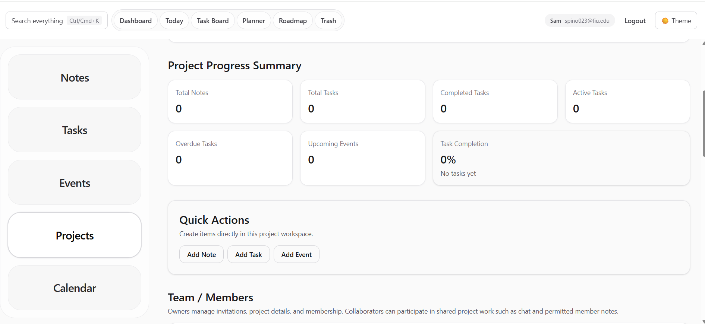
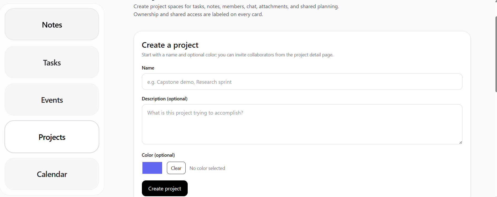
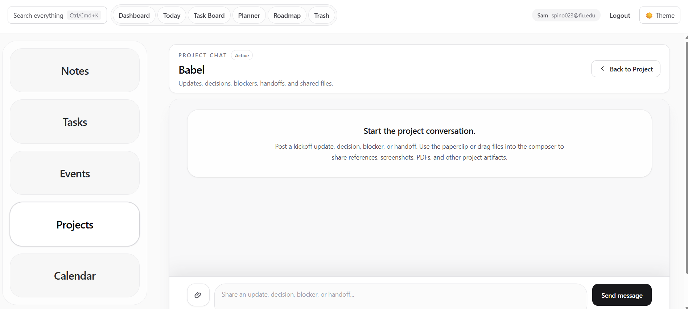

# AI-Multi Task-Management

Live Demo: https://ai-multi-task-management-vercel.vercel.app

AI-Multi Task-Management is a full-stack productivity and collaboration platform built with Next.js, TypeScript, Prisma, PostgreSQL, and Vercel. It supports authentication, notes, tasks, events, projects, project chat, file uploads, invitations, password reset, search, trash, planning views, recurrence, guest mode, and dark mode.

## Key Features

- Secure authentication with signup, login, logout, sessions, and password reset
- Notes, tasks, events, projects, calendars, a rule-based Smart Daily Planner, and trash recovery
- Project collaboration with invitations and role-based Owner, Editor, and Viewer access enforced server-side
- Project chat with file attachments using Vercel Blob storage
- PostgreSQL database modeled with Prisma migrations
- Production deployment on Vercel with Neon PostgreSQL and server-side environment validation
- Smart Daily Planner that analyzes overdue tasks, due-today work, upcoming events, active projects, recent notes, and project follow-up signals without relying on a paid external AI service
- Dark mode and responsive UI

## Tech Stack

- Frontend: Next.js App Router, React, TypeScript, Tailwind CSS
- Backend: Next.js Route Handlers / Server Actions
- Database: PostgreSQL, Prisma ORM, pgAdmin 4
- Storage: Vercel Blob
- Deployment: Vercel
- Email: Resend optional, in-app invitations supported without email

## Screenshots

### Dashboard

### Projects

### Project Chat

